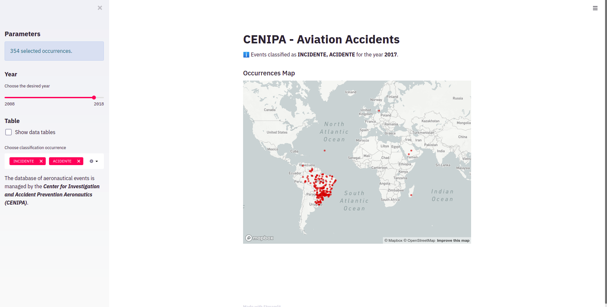

# Machine_Learning_Engineer
[](https://www.linkedin.com/in/edinorjr) [](https://www.python.org/downloads/release/python-365/) [](http://perso.crans.org/besson/LICENSE.html) [](https://github.com/zorrex82/miscellaneous_scripts)

<p align="center">
  
</p>

# Aeronautical Occurrence Data from CENIPA
<sub>*Machine Learning Engineer</sub>

Data application to demonstrate the power of streamlit to create interactive Dashboards..
If you can, please contribute and share your knowledge.

**Some Screenshots from the project running**

<p align="center">
  
</p>

**How to proceed to running this app**

First install the dependencies

Install the dependencies

``` python

pip install -r requirements.txt

```
Execute every script Python as the example below

```python

streamlit run app.py

```

**Links:**

* [LinkedIn](https://www.linkedin.com/in/edinorjr)
---


